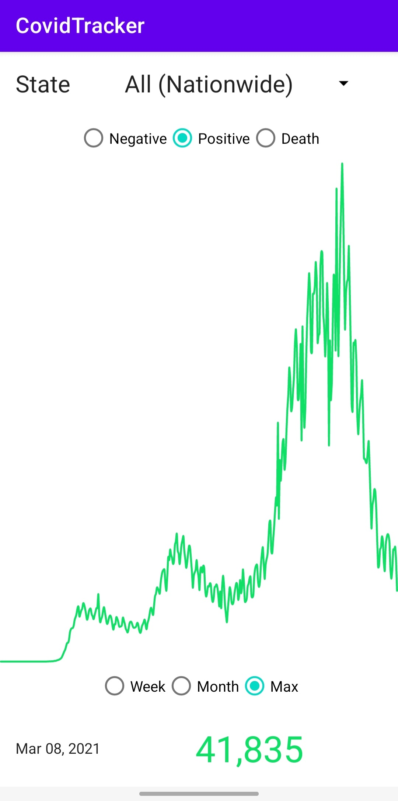
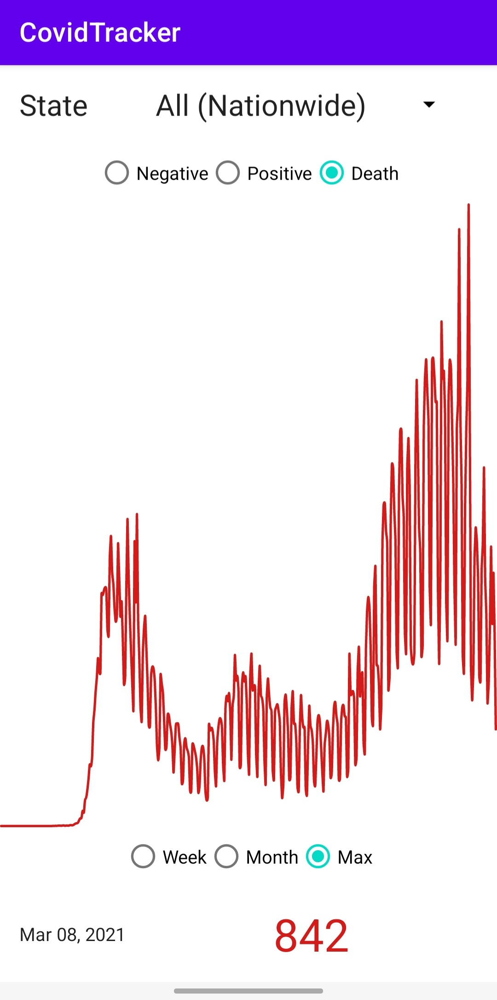

# CovidTracker
Covid Tracker is a simple Covid tracking app which fetches the data using the retrofit2 from the API: https://covidtracking.com/data/api

# Screenshots :
<h4>Screenshots</h4>
<table>
<tbody>
<tr>
<td> </td>
<td> </td>
</tr>
</tbody>
</table>
